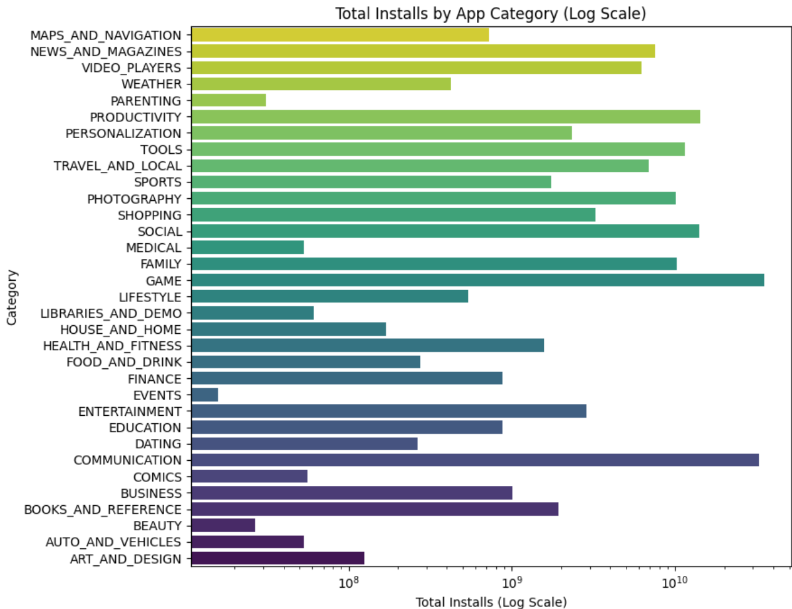

# 📱 Google Play Store App Analysis & Install Prediction

This project explores a dataset of \~11,000 mobile apps from the Google Play Store to identify trends, visualize insights, and build a basic predictive model for app installs. It serves both as an exploratory data analysis (EDA) exercise and a foundation for predictive modeling, helping developers estimate potential install volumes based on app features.



## 🔍 Project Objectives

* Analyze and visualize patterns in Google Play Store data
* Understand app distribution by category, type (Free vs Paid), and content rating
* Predict app install counts using a linear regression model
* Identify opportunities for model improvement

## 🧰 Tools & Libraries

* **pandas** – data manipulation and cleaning
* **numpy** – numerical operations
* **matplotlib** & **seaborn** – data visualization
* **scikit-learn (sklearn)** – machine learning and model evaluation

## 📊 Key Visualizations

- 📊 App distribution by category  
-     Content rating breakdown  
- 🏆 Most downloaded app categories  
- 💸 Free vs Paid: Which type gets more installs?

## 🧼 Data Preparation

* Removed or imputed missing values
* Converted non-numeric columns (e.g., installs, size, reviews) to appropriate numeric types
* Applied **log transformation** to handle extreme skewness in install counts
* Scaled features where appropriate for visual clarity and modeling

## 🤖 Modeling Approach

A simple **Linear Regression** model was built using `scikit-learn` to predict app install counts based on the most influential features.

* Model Performance: Moderate (as expected due to skewed real-world data)
* Limitations:

  * Skewed target variable
  * Potential noise in the dataset
  * No time-based trends incorporated

### 🔧 Future Improvements

* Log-transform the target variable to improve linear model performance
* Apply **binning/bucketing** strategies (e.g., `pd.qcut`) for better classification of install ranges
* Experiment with more advanced models (e.g., Random Forest, Gradient Boosting)
* Incorporate time trends if temporal data becomes available

## 📁 Dataset

* **Source**: [Kaggle – Google Play Store Apps](https://www.kaggle.com/datasets/lava18/google-play-store-apps)
* Contains app metadata such as category, type, ratings, reviews, installs, and more

## 🚀 How to Run

1. Clone this repo:

   ```bash
   git clone https://github.com/damiondaley45/Google-App-Store-Analytics.git
   cd google-playstore-analysis
   ```

2. Install dependencies:

   ```bash
   pip install -r requirements.txt
   ```

3. Run the notebook or script to explore the data and view the visualizations.

## 📌 Author Notes

This project was developed as part of my continued journey from visual analytics to predictive modeling. It demonstrates my ability to blend business curiosity with technical execution, using Python's data ecosystem.